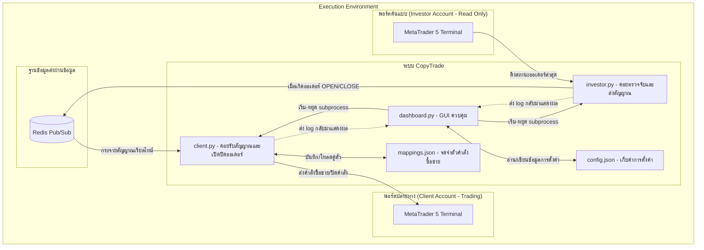

# 📈 MT5 Investor CopyTrade (Gold Edition)

[](https://www.python.org/)
[](https://www.metatrader5.com/)
[](https://redis.io/)
[](LICENSE)

ระบบก๊อปปี้เทรดทองคำ (XAUUSD) ทำงานแบบเรียลไทม์ โดยตรวจจับคำสั่งจากพอร์ต Investor (อ่านได้อย่างเดียว) แล้วส่งสัญญาณไปยังพอร์ต Client เพื่อสั่งเปิด/ปิดออเดอร์ตามการตั้งค่าที่กำหนด

---

## 🏗️ สถาปัตยกรรมและโครงสร้างระบบ (Architecture Flow)

ระบบประกอบด้วยส่วนการทำงานหลัก 3 ส่วนที่ประสานงานกันผ่าน Redis Pub/Sub:



---

## 🌟 ฟีเจอร์เด่น (Key Features)

- Investor Password Compatibility: รองรับการเชื่อมต่อด้วยรหัสแบบ Investor (ดูได้อย่างเดียว)
- Ultra-low Latency (Redis): ส่งต่อสัญญาณเข้า/ปิดออเดอร์แบบเรียลไทม์ผ่าน Redis Pub/Sub
- Order State Recovery (`mappings.json`): จดจำความสัมพันธ์ระหว่าง Ticket ของ Investor และ Client เพื่อรองรับการกู้สถานะคำสั่ง
- Symbol Custom Mapping: รองรับการแมปชื่อสัญลักษณ์ทองคำที่โบรกเกอร์ต่างกันเรียกต่างชื่อกัน
- Smart Lot Calculation:
  - `lot_multiplier`: กำหนดอัตราส่วนในการคูณล็อต
  - `lot_minimum`: กำหนดขนาดล็อตขั้นต่ำที่ระบบจะเปิดเพื่อป้องกันคำสั่งเล็กเกินไป
- Dynamic Logging Interface: GUI แสดง log และข้อผิดพลาดจาก `investor.py` และ `client.py` แบบสด

---

## 📋 สิ่งที่ต้องมี (Prerequisites)

1. MetaTrader 5 ติดตั้งสองตัว (แยกโฟลเดอร์)
   - MT5 ตัวที่ 1: ลงชื่อเข้าใช้บัญชี Investor (ดูได้อย่างเดียว)
   - MT5 ตัวที่ 2: ลงชื่อเข้าใช้บัญชี Client (ใช้เพื่อส่งคำสั่งเทรด)
   - ต้องแยกโฟลเดอร์ติดตั้งของทั้งสองตัวเพื่อไม่ให้โปรไฟล์ทับกัน

2. เปิดใช้งาน Algo Trading ใน MT5 ฝั่ง Client
   1. เปิด MT5 ฝั่ง Client
   2. ไปที่ Tools -> Options
   3. เลือกแท็บ Expert Advisors
   4. ติ๊ก "Allow Algo Trading"
   5. กด OK

3. ติดตั้ง Python 3.8 ขึ้นไป

4. ติดตั้ง/รัน Redis Server (พอร์ตเริ่มต้น 6379) หรือใช้บริการ Redis Cloud

---

## ⚙️ โครงสร้างไฟล์ในโปรเจค (File Structure)

```text
mt5-investor-copytrade/
├── investor.py        # ตรวจสอบคำสั่งซื้อขายของพอร์ต Investor และส่งสัญญาณผ่าน Redis
├── client.py          # รับสัญญาณจาก Redis เพื่อสั่งเปิด/ปิดออเดอร์บน Client MT5
├── dashboard.py       # GUI ควบคุมโปรแกรม สั่งเริ่ม/หยุด และแสดง Log
├── config.json        # เก็บการตั้งค่า (สร้างอัตโนมัติเมื่อรันครั้งแรก)
├── mappings.json      # เก็บความสัมพันธ์ Ticket ระหว่าง Investor และ Client (สร้างขณะรัน)
├── requirements.txt   # รายชื่อแพ็กเกจ Python ที่โปรเจคต้องการ
└── LICENSE            # สัญญาอนุญาตซอฟต์แวร์ MIT
```

---

## 🚀 ขั้นตอนการติดตั้งและการใช้งาน (Usage Guide)

1. ดาวน์โหลดหรือโคลนโปรเจค:

```bash
git clone https://github.com/BlamzKunG/mt5-investor-copytrade.git
cd mt5-investor-copytrade
```

2. ติดตั้ง Dependencies:

```bash
pip install -r requirements.txt
```

3. เริ่ม Redis Server หากยังไม่ได้รัน (เช่น `redis-server`)

4. เปิด Dashboard:

```bash
python dashboard.py
```

เมื่อเปิดครั้งแรก ระบบจะสแกนและสร้าง `config.json` ถ้ายังไม่มี

5. ตั้งค่าผ่าน GUI:
- ใส่พาธ `terminal64.exe` ของ MT5 ทั้งสองตัว
- ตั้งค่า Redis Host/Port/DB/Channel
- ตั้งค่าการคัดลอก (สัญลักษณ์ทองคำ, lot multiplier, min lot, poll interval, magic number, max deviation)

6. เริ่ม/หยุดระบบผ่านปุ่มใน GUI (Start/Stop)

---

## 🔒 ข้อควรระวัง (Technical Notes)

- ระบบกรองสัญญาณเฉพาะสัญลักษณ์ที่กำหนด (เช่น XAUUSD)
- ตรวจสอบสิทธิ์การใช้งานและความปลอดภัยของบัญชี Client ก่อนใช้งานจริง
- ทดสอบในบัญชีทดลองก่อนใช้งานจริงเพื่อลดความเสี่ยง

---

## 📝 สัญญาอนุญาต (License)

โปรเจคนี้ใช้สัญญาอนุญาต MIT License ดูรายละเอียดในไฟล์ LICENSE
