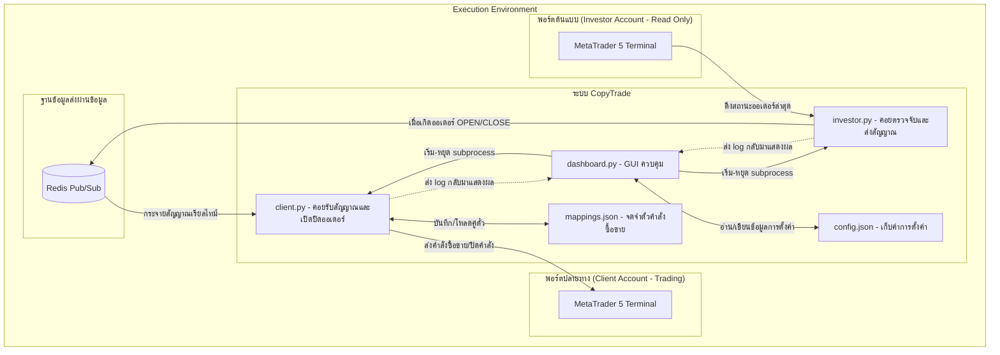

# 📈 MT5 Investor CopyTrade (Gold Edition)

[](https://www.python.org/)
[](https://www.metatrader5.com/)
[](https://redis.io/)
[](LICENSE)

ระบบก๊อปปี้เทรดทองคำ (XAUUSD) อัจฉริยะ ทำงานแบบเรียลไทม์ (Real-time Latency) โดยทำการคัด[...]

---

## 🏗️ สถาปัตยกรรมและโครงสร้างระบบ (Architecture Flow)

ระบบประกอบไปด้วยส่วนการทำงานหลัก 3 ส่วน ที่ประสานงานร่วมกันแบบคู่ขนา[...]



---

## 🌟 ฟีเจอร์เด่น (Key Features)

- **Investor Password Compatibility**: พอร์ตฝั่ง Investor ใช้เพียงรหัสผ่าน Investor (ดูได้อย่างเดียว) ในการต[...]
- **Ultra-low Latency (Redis)**: ส่งต่อสัญญาณการเข้าและปิดออเดอร์ในระดับมิลลิวินาที (Millisecond) ��[...]
- **Order State Recovery (`mappings.json`)**: จดจำตั๋วสั่งซื้อ (Ticket Mapping) ระหว่างฝั่ง Investor และ Client เสมอ หากระ[...]
- **Symbol Custom Mapping**: สัญลักษณ์ทองคำของแต่ละโบรกเกอร์อาจมีชื่อเรียกไม่เหมือนกัน[...]
- **Smart Lot Calculation**:
  - `lot_multiplier`: กำหนดสัดส่วนคูณล็อต (เช่น Investor เปิดล็อต `1.0` หากคูณล็อต `0.5` พอร์ต Client จะ[...]
  - `lot_minimum`: กำหนดเพดานขั้นต่ำสุดเพื่อป้องกันข้อผิดพลาดในการคำนวณล็อตต่ำส�[...]
- **Dynamic Logging Interface**: GUI แสดง Log การรับส่งสัญญาณและข้อผิดพลาดต่าง ๆ สดจาก `investor.py` และ `clie[...]

---

## 📋 สิ่งที่ต้องมี (Prerequisites)

การเปิดใช้งานระบบนี้จำเป็นต้องเตรียมความพร้อมในส่วนต่าง ๆ ดังนี้:

### 1. โปรแกรม MetaTrader 5 จำนวน 2 ตัวติดตั้ง (แยกโฟลเดอร์กัน)
*   **โปรแกรม MT5 ตัวที่ 1 (พอร์ต Investor)**: ล็อกอินบัญชีที่เราต้องการก๊อปปี้ (พอร์ตต�[...]
*   **โปรแกรม MT5 ตัวที่ 2 (พอร์ต Client)**: ล็อกอินบัญชีที่เราต้องการส่งคำสั่งเทรดจ��[...]
*   **ข้อสำคัญ**: ต้องแยกโฟลเดอร์ติดตั้งของโปรแกรม MT5 ทั้งสองตัวออกจากกัน เพ�[...]

### 2. การอนุญาต Algo Trading ในโปรแกรม MT5 (ฝั่ง Client)
โปรแกรม MT5 ฝั่งปลายทาง (Client) จำเป็นต้องเปิดสิทธิ์การส่งคำสั่งอัตโนมัติจา���[...]
1.  เปิดโปรแกรม MT5 ฝั่ง Client
2.  ไปที่เมนู **Tools** -> **Options** (หรือกด `Ctrl + O`)
3.  เลือกแท็บ **Expert Advisors**
4.  ติ๊กเลือกถูกที่ช่อง **"Allow Algo Trading"**
5.  กดปุ่ม **OK**

### 3. โปรแกรม Python
*   ติดตั้ง **Python เวอร์ชัน 3.8 ขึ้นไป** ในเครื่องคอมพิวเตอร์ของคุณ

### 4. Redis Server (Message Broker)
*   ติดตั้งโปรแกรม **Redis Server** หรือใช้บริการ Redis Cloud (พอร์ตมาตรฐานคือ `6379`) สำหรับใช้��[...]

---

## ⚙️ โครงสร้างไฟล์ในโปรเจค (File Structure)

```text
mt5-investor-copytrade/
├── investor.py        # ตรวจสอบคำสั่งซื้อขายของพอร์ต Investor และส่งกระจายสัญญาณผ่าน Red[...]
├── client.py          # รอรับสัญญาณออเดอร์จาก Redis เพื่อสั่งเปิด/ปิดออเดอร์จริงบน Clien[...]
├── dashboard.py       # หน้าต่าง GUI ควบคุมโปรแกรมทั้งหมด สั่งรัน/หยุด และแสดง Log
├── config.json        # เก็บการตั้งค่าตำแหน่งโปรแกรม, Redis และ Lot (สร้างอัตโนมัติเมื่อร��[...]
├── mappings.json      # จดจำความสัมพันธ์คู่ตั๋วออเดอร์ Investor <-> Client (สร้างขณะรัน)
├── requirements.txt   # รายชื่อแพ็กเกจไลบรารี Python ที่โปรเจคต้องการ
└── LICENSE            # สัญญาอนุญาตซอฟต์แวร์แบบ MIT
```

---

## 🚀 ขั้นตอนการติดตั้งและการใช้งานอย่างละเอียด (Usage Guide)

### ขั้นตอนที่ 1: ดาวน์โหลดโปรเจค
ดาวน์โหลดหรือโคลนโปรเจคนี้ลงมายังเครื่องคอมพิวเตอร์:
```bash
git clone https://github.com/BlamzKunG/mt5-investor-copytrade.git
cd mt5-investor-copytrade
```

### ขั้นตอนที่ 2: ติดตั้ง Dependencies
เปิดหน้าจอ Command Line ในโฟลเดอร์โปรเจค แล้วติดตั้งไลบรารีที่จำเป็นผ่านคำส[...]
```bash
pip install -r requirements.txt
```

### ขั้นตอนที่ 3: เปิดใช้งาน Redis Server
ตรวจสอบให้แน่ใจว่าได้เปิดใช้งาน **Redis Server** แล้ว (ทำงานที่พอร์ตเริ่มต้น `6379`[...]

### ขั้นตอนที่ 4: เปิดหน้าควบคุมโปรแกรม (Dashboard)
สั่งรันไฟล์ควบคุมหลักเพื่อเปิดหน้า GUI:
```bash
python dashboard.py
```
*(เมื่อเปิดครั้งแรก ระบบจะสแกนหาและสร้างไฟล์ `config.json` ให้โดยอัตโนมัติ)*

### ขั้นตอนที่ 5: ตั้งค่าผ่านหน้าจอ GUI
กรอกรายละเอียดต่าง ๆ บนหน้าต่างควบคุม:

1.  **MetaTrader 5 Terminals Configuration**:
    *   **Investor Terminal (.exe)**: กดปุ่ม **Browse...** แล้วเลือกไฟล์ `terminal64.exe` ของโปรแกรม MT5 ที่ล็อกอิน��[...]
    *   **Client Terminal (.exe)**: กดปุ่ม **Browse...** แล้วเลือกไฟล์ `terminal64.exe` ของโปรแกรม MT5 ที่ล็อกอินพ�[...]
2.  **Redis Connection**:
    *   **Redis Host**: พิมพ์ `localhost` (หรือใส่ IP/Host ปลายทางกรณีใช้ Redis Server ภายนอก)
    *   **Redis Port**: ใส่ `6379`
    *   **Redis DB**: ใส่ `0`
    *   **Channel Name**: พิมพ์ชื่อช่องส่งสัญญาณ เช่น `copy_trade_gold`
3.  **Copy Trade Settings**:
    *   **Gold Symbol**: ระบุสัญลักษณ์ทองคำของพอร์ตปลายทาง (Client) เช่น `XAUUSD`, `XAUUSD-ECN`, หรือ `XAUUSD.m` [...]
    *   **Lot Multiplier**: อัตราตัวคูณในการก๊อปปี้ล็อต เช่น ใส่ `0.5` หาก Investor เปิดล็อตขนาด [...]
    *   **Min Lot Limit**: ขนาดล็อตขั้นต่ำที่ระบบสามารถกดเปิดได้ เช่น `0.01`
    *   **Poll Interval (s)**: ความถี่ในการสแกนพอร์ต Investor (แนะนำตั้งไว้ที่ `0.05` วินาที)
    *   **Magic Number**: หมายเลขเมจิกเพื่อคัดแยกคำสั่งซื้อขายของระบบ (เช่น `999999`)
    *   **Max Deviation**: ค่าเบี่ยงเบนราคาที่ยอมรับได้สูงสุดในการกดคำสั่งซื้อขาย (เ�[...]

จากนั้นกดปุ่ม **"💾 Save Config"** เพื่อบันทึกค่าการตั้งค่าทั้งหมดเก็บไว้

### ขั้นตอนที่ 6: เริ่มต้นและหยุดการก๊อปปี้เทรด
*   **เริ่มระบบ**: กดปุ่ม **"▶ Start CopyTrade"** โปรแกรมจะทำการเปิดสคริปต์เชื่อมต่อและ��[...]
*   **หยุดระบบ**: กดปุ่ม **"■ Stop CopyTrade"** เพื่อยกเลิกกระบวนการคัดลอกออเดอร์ทั้งหม[...]

---

## 🔒 ข้อมูลความปลอดภัยและคำแนะนำที่สำคัญ (Technical Notes)

*   **ระบบล้างตั๋วอัตโนมัติ**: หากออเดอร์ฝั่ง Client ปิดตัวเองไปด้วยการชนกำไร[...]
*   **สัญญลักษณ์ทองคำเท่านั้น**: ระบบจะทำการกรองสัญญาณและส่งเฉพาะคู่เงิ��[...]

---

## 📝 สัญญาอนุญาต (License)

โปรเจคนี้เผยแพร่ภายใต้สัญญาอนุญาต **MIT License** รายละเอียดเพิ่มเติมสามารถศ�[...]
